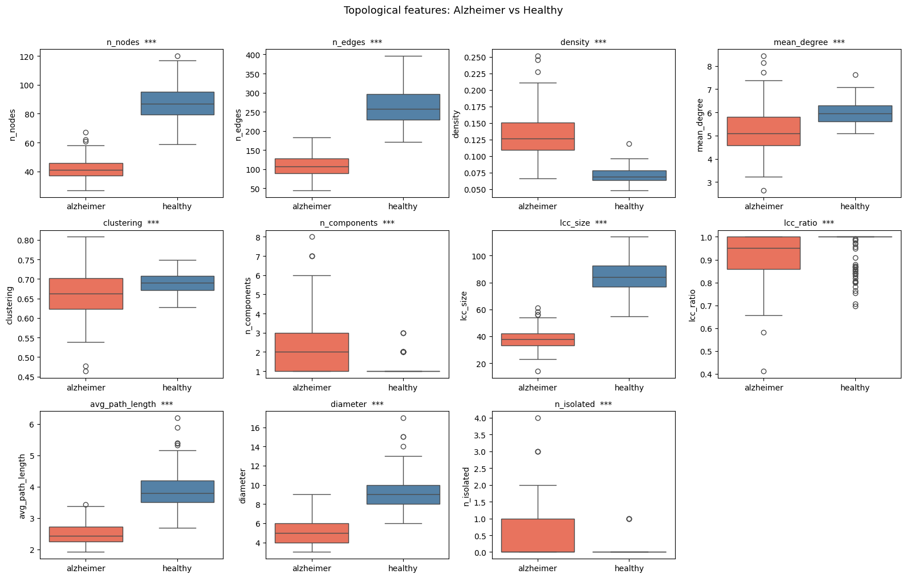
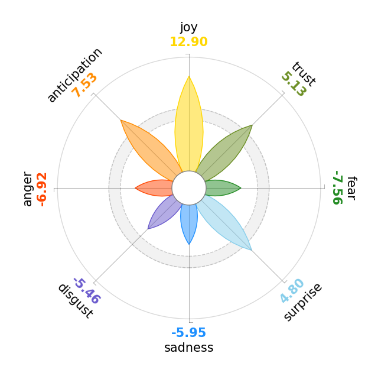
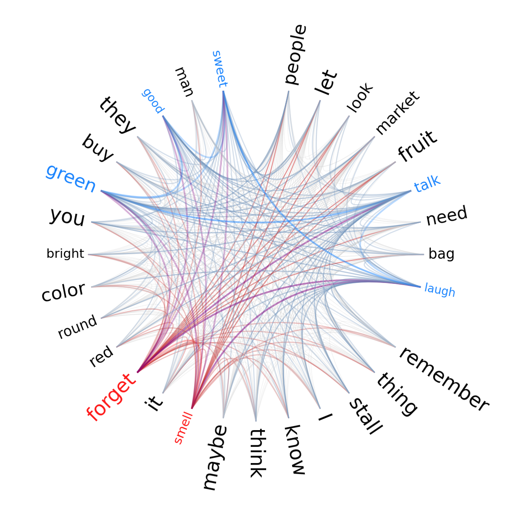
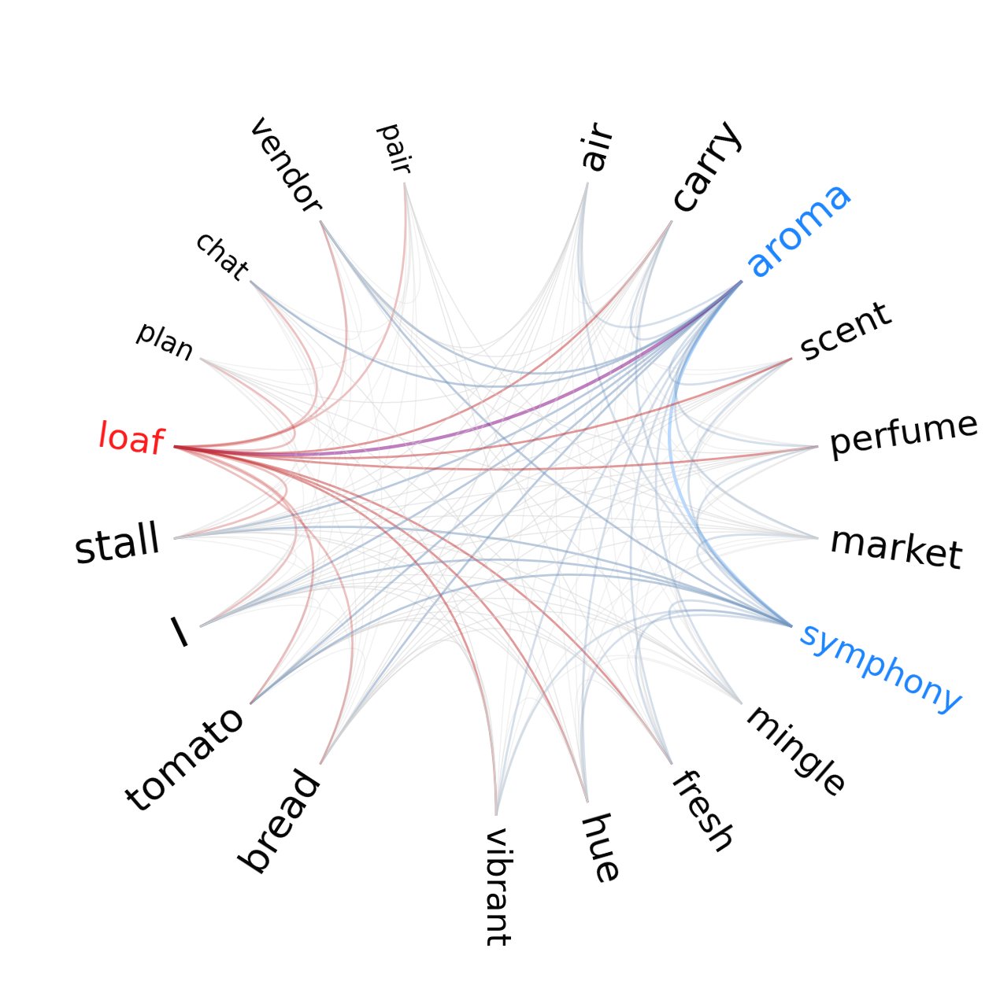
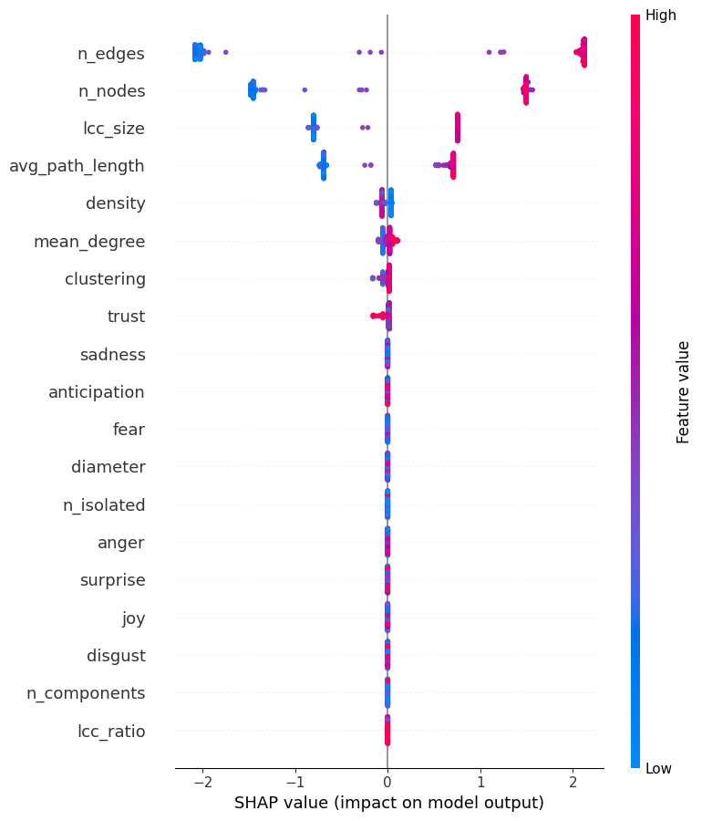
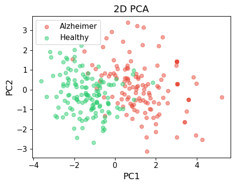

# Modeling Text as a Network to Compare How Two Groups Write

**In plain terms**: this project turns short pieces of text into networks — words become nodes, the connections between them become edges — and compares the shape of those networks between two groups of writers. It also checks whether that network shape, plus the emotional tone of the text, can predict which group a new piece of text belongs to. Crucially, when the prediction turns out suspiciously good, it stops and checks *why* before reporting it as a win.

The two groups used here are simulated Alzheimer's patients and healthy controls (generated by an LLM, not real patient data). The method itself is domain-agnostic: **any time you want to compare how two groups of people express themselves in writing — different customer segments, different survey respondent groups, before/after an intervention, different demographic cohorts — this is a way to go beyond "which words show up more often" and ask whether the underlying structure of how they write is actually different, and whether a good-looking model result is really telling you something new or just tracking a shortcut in the data.**

## Why this is relevant for a quant research team

| What this project does | Where this shows up in industry |
|---|---|
| Converts text into a network and measures its shape (size, density, fragmentation) | A more structural alternative to word-frequency analysis — useful when you care about *how* something is expressed, not just *what* words appear |
| Runs a proper statistical test (Mann-Whitney U) across 11 features with correction for multiple comparisons | The standard, defensible way to compare many metrics between two groups without inflating false positives — directly transferable to A/B test analysis or segment comparison |
| Gets a suspiciously good classification result, then runs five separate checks (SHAP, LDA, PCA, and two rounds of raw-text sanity tests) to find out why | The single most valuable habit in this project — catching that near-perfect accuracy was a property of the (synthetic) data, not a validated signal, before it gets reported upward |
| Documents the limitation clearly and names the exact next step (testing on real data) | What separates an analysis that gets trusted from one that gets over-sold |

## What's inside

- **Text-as-network feature engineering**: representing text as a graph and extracting structural metrics (density, clustering, fragmentation, path length)
- **Lexicon-based emotion scoring**: mapping text onto an 8-emotion psychological framework, independent of black-box sentiment models
- **Group comparison with proper multiple-testing correction**: Mann-Whitney U + Benjamini-Hochberg FDR
- **Five-classifier comparison with an overfitting check**: logistic regression, decision tree, random forest, gradient boosting, and XGBoost, each with train-test AUC gap reported alongside test AUC
- **Explainability**: SHAP to see which features actually drive the classifier's decisions
- **A built-in sanity check on the result itself**: LDA/PCA separability, plus direct TF-IDF and document-length checks on the raw text, specifically designed to catch an over-optimistic result before reporting it

## Research question

Do Alzheimer's-simulated and healthy-simulated texts differ in the structure of their underlying word-association networks and in their emotional tone — and can those differences actually classify new text, or does high classification accuracy just reflect how the synthetic data was generated?

## Data

- **Fully synthetic**: text was LLM-generated (Mistral Large 3) to mimic AD-patient and healthy-control writing styles describing a day at a local market — no real patient data involved
- A small illustrative sample is included at `data/sample_merged_paragraphs.json` to keep the notebook runnable; see [`data/README.md`](data/README.md) for how the real dataset was generated and how to recreate it
- The figures below and in [`docs/report.pdf`](docs/report.pdf) are from the actual analysis on the full corpus

## Method

1. **Network construction**: each text parsed with spaCy and converted into a word-association network (a Textual Forma Mentis Network) via EmoAtlas, linking words by syntactic proximity rather than raw co-occurrence
2. **Topological features**: 11 graph metrics per text — nodes, edges, density, clustering, connected components, largest-component size and ratio, average path length, diameter, isolated nodes
3. **Emotional features**: 8 emotion z-scores (Plutchik's model) via cross-reference with the NRC Emotion Lexicon
4. **Group comparison**: Mann-Whitney U test per topological feature, Benjamini-Hochberg FDR correction across all 11
5. **Classification**: five classifiers on emotion features (primary result: logistic regression and decision tree, matching the original study design) plus a full-feature-set comparison, all under 10-fold stratified cross-validation
6. **Sanity check on the classification result**: SHAP explainability, LDA/PCA on the same features, and four additional checks directly on the raw text (TF-IDF separability, discriminating tokens, stylometric features, and classification using document length alone)

## Selected results

**Network structure**: AD-simulated networks are consistently smaller, more fragmented, and structurally simpler than healthy-simulated ones.



**Emotional profile**: healthy-simulated text shows a clearly differentiated emotional signature, dominated by positive emotions well above baseline.



**Word-association networks**: the AD-simulated corpus centers on repetition and word-finding difficulty; the healthy-simulated corpus centers on rich, sensory vocabulary.

<table>
<tr>
<td></td>
<td></td>
</tr>
</table>

**Classification looked almost too good** — logistic regression reached AUC = 0.97 on just 8 emotion features. SHAP shows why that's worth a second look: network-size features dominate feature importance far more than any individual emotion, even in a model trained on the full feature set.



**PCA on the same 8 emotion features, without using the labels at all**, shows the two groups separating almost completely on their own — the clearest sign that this particular synthetic dataset is unusually homogeneous within each group, rather than confirmation of a subtle clinical signal.



Direct checks on the raw text (TF-IDF separability, individual discriminating tokens, and classification using document length alone) confirmed this: a meaningful share of the classification signal traces back to surface-level writing style differences the LLM introduced, not to a validated emotional or structural marker. Full detail, tables, and the complete discussion are in [`docs/report.pdf`](docs/report.pdf).

## Repository structure

```
.
├── tfmn_alzheimer_analysis.ipynb   # full pipeline: network construction, stats, classification, sanity checks
├── assets/                          # figures from the actual analysis (used in this README and the PDF report)
├── data/
│   ├── README.md                    # how the real dataset was generated + how to recreate it
│   └── sample_merged_paragraphs.json  # small illustrative sample (not the real data)
├── docs/
│   └── report.pdf                   # full write-up with results, discussion, references
├── requirements.txt
└── README.md
```

## Reproducing the analysis

```bash
pip install -r requirements.txt
python -m spacy download en_core_web_lg
python -c "import nltk; nltk.download('wordnet'); nltk.download('omw-1.4')"
jupyter notebook tfmn_alzheimer_analysis.ipynb
```

The notebook runs end to end on the included sample data. For the real dataset,
see [`data/README.md`](data/README.md).

## Limitations

- **The dataset is synthetic.** It's a reasonable way to prototype the pipeline without privacy concerns, but the near-perfect classification accuracy is very likely an artifact of LLM-generated text being unusually homogeneous within each group — not evidence that this method detects Alzheimer's disease from real text. The next step is running the same pipeline on real transcript data (DementiaBank Pitt Corpus or the ADReSS challenge dataset) and comparing.
- **Density needs a careful read.** AD-simulated networks were denser, but density scales inversely with network size — with far fewer nodes, this is likely a side effect of network size rather than evidence of richer connectivity.
- **Small sample.** The topological comparison and classification were run on a modest number of documents; the effect sizes reported in `docs/report.pdf` should be read as preliminary rather than final.
